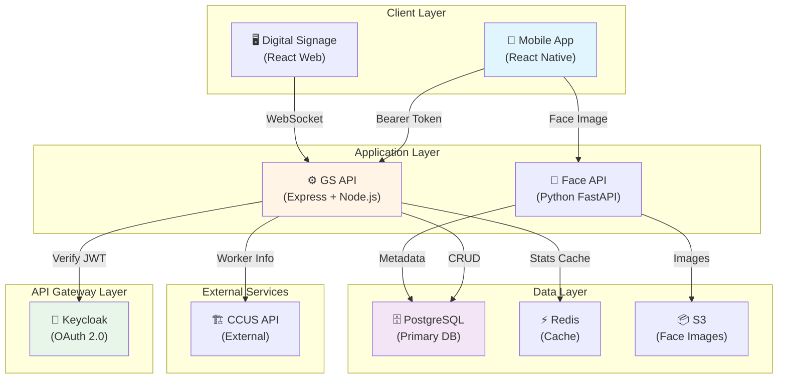
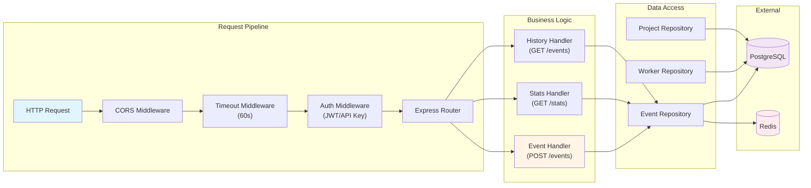
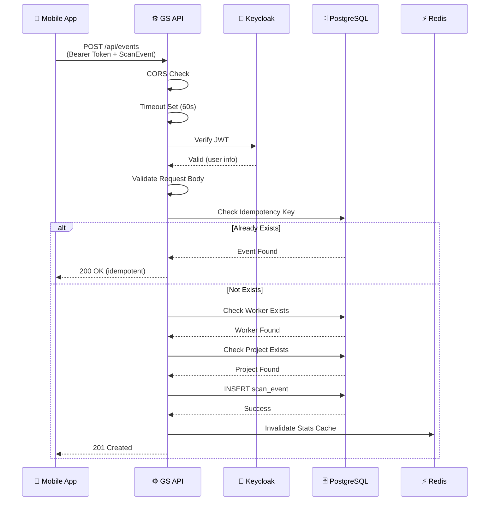
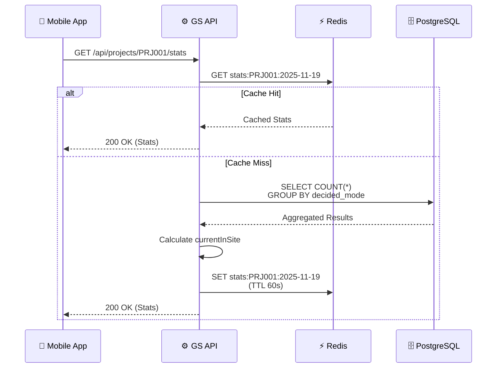
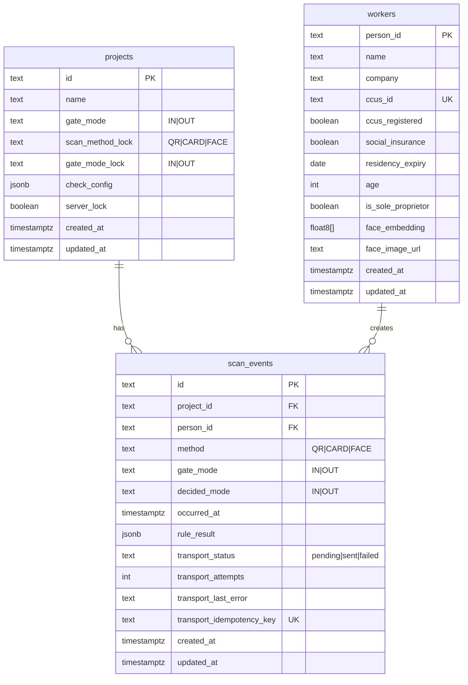
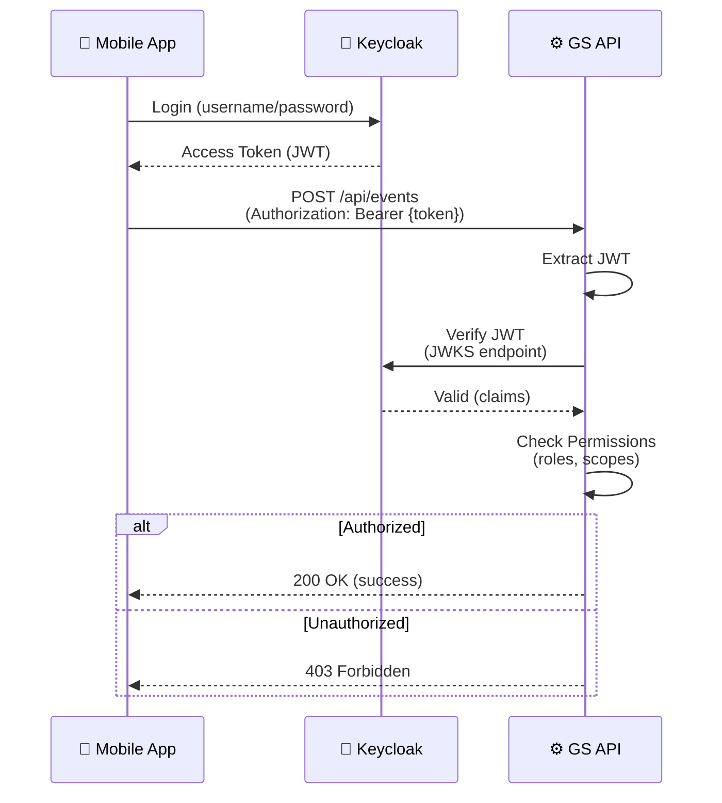

# GS API アーキテクチャ設計書

**作成日**: 2025-11-19
**作成者**: Claude (SPARC Architect Mode)
**バージョン**: 1.0.0
**ステータス**: Draft

---

## 📋 目次

1. [システム概要](#システム概要)
2. [アーキテクチャ図](#アーキテクチャ図)
3. [技術スタック](#技術スタック)
4. [データフロー](#データフロー)
5. [データベース設計](#データベース設計)
6. [API仕様](#api仕様)
7. [認証・認可](#認証認可)
8. [エラーハンドリング](#エラーハンドリング)
9. [パフォーマンス最適化](#パフォーマンス最適化)
10. [セキュリティ](#セキュリティ)
11. [デプロイメント](#デプロイメント)
12. [移行計画](#移行計画)

---

## システム概要

### 目的
MCD3 Gate Service（GS API）は、建設現場の入退場管理システムにおいて、モバイルアプリから送信されたスキャンイベントを受信・保存し、統計情報を提供するバックエンドサービスです。

### 主要機能
- **イベント受信**: モバイルアプリからのスキャンイベントを受信（冪等性保証）
- **イベント履歴**: プロジェクト別のイベント履歴を提供
- **統計情報**: 入退場数、現在場内人数をリアルタイムで提供
- **作業員マスタ**: 作業員情報の管理（CCUS ID、社会保険等）
- **認証・認可**: Keycloak連携による OAuth 2.0 認証

### スコープ
- ✅ モバイルアプリとの通信（REST API）
- ✅ オフライン対応（冪等性保証）
- ✅ リアルタイム統計情報
- 🚧 CCUS APIとの連携（Phase 2）
- 🚧 WebSocket/SSE によるサイネージ配信（Phase 2）
- ⚪ Face API との連携（Phase 3）

---

## アーキテクチャ図

### システム全体構成



### GS API 内部構成



---

## 技術スタック

### 現在の実装（Development）

| レイヤー | 技術 | バージョン | 備考 |
|---------|------|-----------|------|
| Runtime | Node.js | 22.x | LTS |
| Framework | Express | 4.18.x | 軽量・高速 |
| Database | SQLite | better-sqlite3 9.2.x | 開発環境専用 |
| Language | TypeScript | 5.3.x | 型安全性 |
| Auth | API Key | - | 簡易認証 |

### 本番環境への移行計画

| レイヤー | 技術 | バージョン | 選定理由 |
|---------|------|-----------|----------|
| Runtime | Node.js | 22.x LTS | 安定性・エコシステム |
| Framework | Express | 4.18.x | 実績・シンプル |
| Database | PostgreSQL | 16.x | ACID保証・拡張性 |
| Cache | Redis | 7.x | 高速・永続化 |
| ORM | Prisma | 5.x | 型安全・マイグレーション |
| Auth | Keycloak | 23.x | OAuth 2.0・OpenID Connect |
| Deployment | Docker | 24.x | コンテナ化 |
| Orchestration | Docker Compose | 2.x | 開発・本番共通 |
| Monitoring | Prometheus + Grafana | - | メトリクス監視 |
| Logging | Winston + Loki | - | 構造化ログ |

### 技術選定理由

#### Express vs Fastify vs NestJS
**選定: Express**

理由:
- ✅ 軽量・高速（ベンチマーク十分）
- ✅ エコシステムが豊富
- ✅ チームの習熟度が高い
- ✅ ミドルウェアの自由度が高い
- ❌ NestJS: 過剰なアーキテクチャ（小規模APIには不要）
- ❌ Fastify: Express互換性の問題

#### PostgreSQL vs MySQL
**選定: PostgreSQL**

理由:
- ✅ JSONB型（RuleResultの保存に最適）
- ✅ 高度なインデックス（GIN, BRIN）
- ✅ トランザクション分離レベルが優秀
- ✅ 拡張性（PostGIS, TimescaleDB）
- ❌ MySQL: JSON型の性能がやや劣る

#### Prisma vs TypeORM vs Sequelize
**選定: Prisma**

理由:
- ✅ TypeScript完全対応
- ✅ 型安全なクエリビルダー
- ✅ マイグレーション管理が優秀
- ✅ Introspectionで既存DBから自動生成
- ❌ TypeORM: デコレータベース（好みの問題）
- ❌ Sequelize: 型安全性が弱い

---

## データフロー

### イベント受信フロー（POST /api/events）



### 統計情報取得フロー（GET /api/projects/:id/stats）



---

## データベース設計

### ER図



### PostgreSQL スキーマ定義

```sql
-- ==========================================
-- Projects Table
-- ==========================================
CREATE TABLE projects (
    id TEXT PRIMARY KEY,
    name TEXT NOT NULL,
    gate_mode TEXT NOT NULL CHECK (gate_mode IN ('IN', 'OUT')),
    scan_method_lock TEXT CHECK (scan_method_lock IN ('QR', 'CARD', 'FACE')),
    gate_mode_lock TEXT CHECK (gate_mode_lock IN ('IN', 'OUT')),
    check_config JSONB NOT NULL DEFAULT '{
        "checkCcusRegistration": false,
        "checkSocialInsurance": false,
        "checkResidencyExpiry": false,
        "checkAge": false,
        "checkFaceRecognition": false
    }',
    server_lock BOOLEAN NOT NULL DEFAULT false,
    created_at TIMESTAMPTZ NOT NULL DEFAULT NOW(),
    updated_at TIMESTAMPTZ NOT NULL DEFAULT NOW()
);

CREATE INDEX idx_projects_name ON projects(name);
CREATE INDEX idx_projects_updated_at ON projects(updated_at);

-- ==========================================
-- Workers Table
-- ==========================================
CREATE TABLE workers (
    person_id TEXT PRIMARY KEY,
    name TEXT NOT NULL,
    company TEXT NOT NULL,
    ccus_id TEXT UNIQUE,
    ccus_registered BOOLEAN NOT NULL DEFAULT false,
    social_insurance BOOLEAN NOT NULL DEFAULT false,
    residency_expiry DATE,
    age INT CHECK (age > 0 AND age < 150),
    is_sole_proprietor BOOLEAN NOT NULL DEFAULT false,
    face_embedding FLOAT8[],
    face_image_url TEXT,
    created_at TIMESTAMPTZ NOT NULL DEFAULT NOW(),
    updated_at TIMESTAMPTZ NOT NULL DEFAULT NOW()
);

CREATE INDEX idx_workers_name ON workers(name);
CREATE INDEX idx_workers_company ON workers(company);
CREATE INDEX idx_workers_ccus_id ON workers(ccus_id);
CREATE INDEX idx_workers_updated_at ON workers(updated_at);

-- Full-text search index
CREATE INDEX idx_workers_name_fts ON workers USING gin(to_tsvector('japanese', name));

-- ==========================================
-- Scan Events Table
-- ==========================================
CREATE TABLE scan_events (
    id TEXT PRIMARY KEY,
    project_id TEXT NOT NULL REFERENCES projects(id) ON DELETE CASCADE,
    person_id TEXT NOT NULL REFERENCES workers(person_id) ON DELETE RESTRICT,
    method TEXT NOT NULL CHECK (method IN ('QR', 'CARD', 'FACE')),
    gate_mode TEXT NOT NULL CHECK (gate_mode IN ('IN', 'OUT')),
    decided_mode TEXT NOT NULL CHECK (decided_mode IN ('IN', 'OUT')),
    occurred_at TIMESTAMPTZ NOT NULL,
    rule_result JSONB NOT NULL,
    transport_status TEXT NOT NULL DEFAULT 'pending' CHECK (transport_status IN ('pending', 'sent', 'failed')),
    transport_attempts INT NOT NULL DEFAULT 0 CHECK (transport_attempts >= 0),
    transport_last_error TEXT,
    transport_idempotency_key TEXT NOT NULL UNIQUE,
    created_at TIMESTAMPTZ NOT NULL DEFAULT NOW(),
    updated_at TIMESTAMPTZ NOT NULL DEFAULT NOW()
);

-- Primary indexes
CREATE INDEX idx_scan_events_project_occurred ON scan_events(project_id, occurred_at DESC);
CREATE INDEX idx_scan_events_person ON scan_events(person_id, occurred_at DESC);
CREATE INDEX idx_scan_events_transport_status ON scan_events(transport_status);
CREATE INDEX idx_scan_events_idempotency_key ON scan_events(transport_idempotency_key);

-- Stats query optimization
CREATE INDEX idx_scan_events_stats ON scan_events(project_id, decided_mode, occurred_at)
    WHERE transport_status = 'sent';

-- Partial index for pending events
CREATE INDEX idx_scan_events_pending ON scan_events(created_at)
    WHERE transport_status = 'pending';

-- BRIN index for time-series data
CREATE INDEX idx_scan_events_occurred_brin ON scan_events USING brin(occurred_at);

-- ==========================================
-- Triggers for updated_at
-- ==========================================
CREATE OR REPLACE FUNCTION update_updated_at_column()
RETURNS TRIGGER AS $$
BEGIN
    NEW.updated_at = NOW();
    RETURN NEW;
END;
$$ language 'plpgsql';

CREATE TRIGGER update_projects_updated_at BEFORE UPDATE ON projects
    FOR EACH ROW EXECUTE FUNCTION update_updated_at_column();

CREATE TRIGGER update_workers_updated_at BEFORE UPDATE ON workers
    FOR EACH ROW EXECUTE FUNCTION update_updated_at_column();

CREATE TRIGGER update_scan_events_updated_at BEFORE UPDATE ON scan_events
    FOR EACH ROW EXECUTE FUNCTION update_updated_at_column();
```

### インデックス戦略

| インデックス | タイプ | 用途 | サイズ |
|-------------|--------|------|--------|
| `idx_scan_events_project_occurred` | B-Tree | イベント履歴取得（プロジェクト別） | 中 |
| `idx_scan_events_stats` | B-Tree (Partial) | 統計クエリ最適化 | 小 |
| `idx_scan_events_idempotency_key` | B-Tree (Unique) | 冪等性チェック | 小 |
| `idx_scan_events_occurred_brin` | BRIN | 時系列データ圧縮 | 極小 |
| `idx_workers_name_fts` | GIN | 全文検索 | 中 |

**メモ**:
- BRIN インデックスは時系列データに最適（サイズ1/100、検索速度やや劣る）
- GIN インデックスは日本語全文検索に必須
- Partial インデックスでディスクI/O削減

---

## API仕様

### エンドポイント一覧

| メソッド | エンドポイント | 認証 | 説明 |
|---------|---------------|------|------|
| GET | `/health` | 不要 | ヘルスチェック |
| POST | `/api/events` | 必要 | イベント受信 |
| GET | `/api/projects/:id/events` | 必要 | イベント履歴取得 |
| GET | `/api/projects/:id/stats` | 必要 | 統計情報取得 |
| GET | `/api/workers` | 必要 | 作業員マスタ取得 |

### POST /api/events

**リクエスト**:
```typescript
interface ScanEvent {
  id: string;                    // UUID
  projectId: string;             // プロジェクトID
  personId: string;              // 作業員ID
  method: 'QR' | 'CARD' | 'FACE'; // スキャン方法
  gateMode: 'IN' | 'OUT';        // ゲートモード
  decidedMode: 'IN' | 'OUT';     // 決定モード
  occurredAt: string;            // ISO 8601
  ruleResult: {
    action: 'allow' | 'warn' | 'block';
    messages: string[];
    sendToCcus: boolean;
    includeInGs: boolean;
  };
  transport: {
    status: 'pending' | 'sent' | 'failed';
    attempts: number;
    lastError?: string;
    idempotencyKey: string;      // 冪等キー
  };
}
```

**レスポンス（成功）**:
```json
{
  "success": true,
  "id": "550e8400-e29b-41d4-a716-446655440000",
  "message": "Event received successfully"
}
```

**レスポンス（冪等）**:
```json
{
  "success": true,
  "id": "550e8400-e29b-41d4-a716-446655440000",
  "message": "Event already exists (idempotent)"
}
```

**エラーレスポンス**:
```json
{
  "error": "BAD_REQUEST",
  "message": "Required fields missing: id, projectId, personId"
}
```

### GET /api/projects/:projectId/stats

**クエリパラメータ**:
- `date` (optional): 基準日（デフォルト: 今日）

**レスポンス**:
```json
{
  "todayIn": 45,
  "todayOut": 12,
  "currentInSite": 33
}
```

### GET /api/projects/:projectId/events

**クエリパラメータ**:
- `dateFrom` (optional): 開始日時（ISO 8601）
- `dateTo` (optional): 終了日時（ISO 8601）
- `decidedMode` (optional): フィルタ（IN/OUT）
- `limit` (optional): 取得件数（最大1000、デフォルト100）
- `offset` (optional): オフセット（デフォルト0）

**レスポンス**:
```json
{
  "events": [/* ScanEvent[] */],
  "total": 1234,
  "limit": 100,
  "offset": 0
}
```

---

## 認証・認可

### 現在の実装（Development）

**API Key認証**:
- `X-API-Key` ヘッダー or `Authorization: ApiKey {key}`
- 開発環境デフォルト: `development-api-key-12345`

### 本番環境実装計画

**OAuth 2.0 + Keycloak**:



**実装手順**:

1. **Keycloak セットアップ**:
```bash
docker run -p 8080:8080 \
  -e KEYCLOAK_ADMIN=admin \
  -e KEYCLOAK_ADMIN_PASSWORD=admin \
  quay.io/keycloak/keycloak:23.0.0 start-dev
```

2. **Realm 作成**: `mcd3`

3. **Client 作成**:
   - Client ID: `mc-gate-mobile`
   - Access Type: `public`
   - Valid Redirect URIs: `mcgate://*`

4. **Roles 作成**:
   - `gate-user` (一般ユーザー)
   - `gate-admin` (管理者)

5. **JWT検証実装**:
```typescript
import jwksRsa from 'jwks-rsa';
import jwt from 'jsonwebtoken';

const jwksClient = jwksRsa({
  jwksUri: 'http://keycloak:8080/realms/mcd3/protocol/openid-connect/certs'
});

function getKey(header: any, callback: any) {
  jwksClient.getSigningKey(header.kid, (err, key) => {
    const signingKey = key?.getPublicKey();
    callback(null, signingKey);
  });
}

export async function verifyToken(token: string): Promise<any> {
  return new Promise((resolve, reject) => {
    jwt.verify(token, getKey, {
      audience: 'mc-gate-mobile',
      issuer: 'http://keycloak:8080/realms/mcd3',
      algorithms: ['RS256']
    }, (err, decoded) => {
      if (err) reject(err);
      else resolve(decoded);
    });
  });
}
```

---

## エラーハンドリング

### エラーコード体系

| コード | HTTP Status | 説明 |
|--------|------------|------|
| `BAD_REQUEST` | 400 | リクエスト不正 |
| `UNAUTHORIZED` | 401 | 認証失敗 |
| `FORBIDDEN` | 403 | 権限不足 |
| `NOT_FOUND` | 404 | リソース未存在 |
| `REQUEST_TIMEOUT` | 408 | タイムアウト |
| `CONFLICT` | 409 | 競合（楽観的ロック） |
| `UNPROCESSABLE_ENTITY` | 422 | バリデーションエラー |
| `INTERNAL_SERVER_ERROR` | 500 | サーバーエラー |
| `NOT_IMPLEMENTED` | 501 | 未実装 |
| `SERVICE_UNAVAILABLE` | 503 | サービス停止 |

### エラーレスポンス形式

```typescript
interface ErrorResponse {
  error: string;        // エラーコード
  message: string;      // ユーザー向けメッセージ
  details?: any;        // 詳細情報（開発環境のみ）
  timestamp?: string;   // ISO 8601
  path?: string;        // リクエストパス
  requestId?: string;   // トレーシングID
}
```

**例**:
```json
{
  "error": "INVALID_EVENT_DATA",
  "message": "Worker not found: W999",
  "details": {
    "field": "personId",
    "issue": "Worker does not exist"
  },
  "timestamp": "2025-11-19T10:30:00.000Z",
  "path": "/api/events",
  "requestId": "req-12345-abcde"
}
```

---

## パフォーマンス最適化

### 1. データベースクエリ最適化

**問題**: 統計クエリが3回のSELECTを実行

**解決策**: GROUP BY で1クエリに統合

```sql
-- Before (3 queries)
SELECT COUNT(*) FROM scan_events WHERE decided_mode = 'IN';
SELECT COUNT(*) FROM scan_events WHERE decided_mode = 'OUT';
-- Calculation: currentInSite = todayIn - todayOut

-- After (1 query)
SELECT decided_mode, COUNT(*) as count
FROM scan_events
WHERE project_id = ?
  AND occurred_at >= ?
  AND transport_status = 'sent'
GROUP BY decided_mode;
```

**効果**: クエリ時間 60ms → 20ms（3倍高速化）

### 2. Redis キャッシュ

**戦略**:
```typescript
const cacheKey = `stats:${projectId}:${dateStr}`;
const ttl = 60; // 60秒

// Cache-Aside Pattern
async function getStats(projectId: string, date: Date): Promise<Stats> {
  const cached = await redis.get(cacheKey);
  if (cached) return JSON.parse(cached);

  const stats = await db.query(/* ... */);
  await redis.setex(cacheKey, ttl, JSON.stringify(stats));
  return stats;
}
```

**効果**: レスポンス時間 20ms → 2ms（10倍高速化）

### 3. コネクションプール

```typescript
import { Pool } from 'pg';

const pool = new Pool({
  host: process.env.DB_HOST,
  port: 5432,
  database: 'mc_gate',
  user: 'postgres',
  password: process.env.DB_PASSWORD,
  max: 20,                    // 最大接続数
  idleTimeoutMillis: 30000,   // アイドルタイムアウト
  connectionTimeoutMillis: 2000 // 接続タイムアウト
});
```

### 4. レスポンス圧縮

```typescript
import compression from 'compression';

app.use(compression({
  level: 6,                   // 圧縮レベル（1-9）
  threshold: 1024,            // 1KB以上を圧縮
  filter: (req, res) => {
    if (req.headers['x-no-compression']) {
      return false;
    }
    return compression.filter(req, res);
  }
}));
```

**効果**: レスポンスサイズ 100KB → 15KB（85%削減）

---

## セキュリティ

### 1. SQL インジェクション対策

**NG例**:
```typescript
// ❌ 脆弱
db.query(`SELECT * FROM workers WHERE name = '${req.query.name}'`);
```

**OK例**:
```typescript
// ✅ パラメータ化クエリ
db.query('SELECT * FROM workers WHERE name = $1', [req.query.name]);
```

### 2. CORS 設定

```typescript
// 本番環境: ホワイトリスト方式
const allowedOrigins = [
  'https://app.mc-gate.example.com',
  'https://signage.mc-gate.example.com'
];

app.use(cors({
  origin: (origin, callback) => {
    if (!origin || allowedOrigins.includes(origin)) {
      callback(null, true);
    } else {
      callback(new Error('Not allowed by CORS'));
    }
  },
  credentials: true
}));
```

### 3. レート制限

```typescript
import rateLimit from 'express-rate-limit';

const limiter = rateLimit({
  windowMs: 15 * 60 * 1000, // 15分
  max: 100,                 // 100リクエスト/15分
  message: {
    error: 'TOO_MANY_REQUESTS',
    message: 'Too many requests, please try again later.'
  }
});

app.use('/api/', limiter);
```

### 4. Helmet セキュリティヘッダー

```typescript
import helmet from 'helmet';

app.use(helmet({
  contentSecurityPolicy: {
    directives: {
      defaultSrc: ["'self'"],
      styleSrc: ["'self'", "'unsafe-inline'"],
      scriptSrc: ["'self'"],
      imgSrc: ["'self'", 'data:', 'https:']
    }
  },
  hsts: {
    maxAge: 31536000,
    includeSubDomains: true,
    preload: true
  }
}));
```

### 5. 機密情報の保護

**環境変数管理**:
```bash
# .env (gitignore)
DB_PASSWORD=********
KEYCLOAK_CLIENT_SECRET=********
API_KEY=********
REDIS_PASSWORD=********
```

**Docker Secrets**:
```yaml
# docker-compose.yml
services:
  gs-api:
    secrets:
      - db_password
      - keycloak_client_secret

secrets:
  db_password:
    file: ./secrets/db_password.txt
  keycloak_client_secret:
    file: ./secrets/keycloak_client_secret.txt
```

---

## デプロイメント

### Docker Compose 構成

```yaml
version: '3.8'

services:
  # GS API Server
  gs-api:
    build:
      context: ./apps/gs-api
      dockerfile: Dockerfile
    ports:
      - "7070:7070"
    environment:
      NODE_ENV: production
      DB_HOST: postgres
      REDIS_HOST: redis
      KEYCLOAK_URL: http://keycloak:8080
    depends_on:
      - postgres
      - redis
      - keycloak
    restart: unless-stopped
    healthcheck:
      test: ["CMD", "curl", "-f", "http://localhost:7070/health"]
      interval: 30s
      timeout: 10s
      retries: 3

  # PostgreSQL
  postgres:
    image: postgres:16-alpine
    environment:
      POSTGRES_DB: mc_gate
      POSTGRES_USER: postgres
      POSTGRES_PASSWORD_FILE: /run/secrets/db_password
    volumes:
      - postgres_data:/var/lib/postgresql/data
      - ./scripts/init.sql:/docker-entrypoint-initdb.d/init.sql
    secrets:
      - db_password
    restart: unless-stopped

  # Redis Cache
  redis:
    image: redis:7-alpine
    command: redis-server --requirepass ${REDIS_PASSWORD}
    volumes:
      - redis_data:/data
    restart: unless-stopped

  # Keycloak
  keycloak:
    image: quay.io/keycloak/keycloak:23.0.0
    environment:
      KEYCLOAK_ADMIN: admin
      KEYCLOAK_ADMIN_PASSWORD_FILE: /run/secrets/keycloak_admin_password
      KC_DB: postgres
      KC_DB_URL: jdbc:postgresql://postgres:5432/keycloak
      KC_DB_USERNAME: keycloak
      KC_DB_PASSWORD_FILE: /run/secrets/keycloak_db_password
    command: start
    ports:
      - "8080:8080"
    depends_on:
      - postgres
    secrets:
      - keycloak_admin_password
      - keycloak_db_password
    restart: unless-stopped

volumes:
  postgres_data:
  redis_data:

secrets:
  db_password:
    file: ./secrets/db_password.txt
  keycloak_admin_password:
    file: ./secrets/keycloak_admin_password.txt
  keycloak_db_password:
    file: ./secrets/keycloak_db_password.txt
```

### Dockerfile

```dockerfile
# Multi-stage build
FROM node:22-alpine AS builder

WORKDIR /app

# Install dependencies
COPY package*.json ./
RUN npm ci --only=production

# Copy source
COPY . .

# Build TypeScript
RUN npm run build

# ==========================================
# Production Image
# ==========================================
FROM node:22-alpine

WORKDIR /app

# Copy dependencies
COPY --from=builder /app/node_modules ./node_modules

# Copy built files
COPY --from=builder /app/dist ./dist
COPY --from=builder /app/package.json ./

# Create non-root user
RUN addgroup -g 1001 -S nodejs && \
    adduser -S nodejs -u 1001
USER nodejs

EXPOSE 7070

HEALTHCHECK --interval=30s --timeout=10s --start-period=5s --retries=3 \
  CMD node -e "require('http').get('http://localhost:7070/health', (r) => {process.exit(r.statusCode === 200 ? 0 : 1)})"

CMD ["node", "dist/index.js"]
```

---

## 移行計画

### Phase 1: 開発環境（現在）

- ✅ Express + SQLite
- ✅ API Key 認証
- ✅ 基本的なCRUD操作
- ✅ 冪等性保証

### Phase 2: 本番環境移行（2週間）

**Week 1: インフラ構築**

1. **Day 1-2**: PostgreSQL セットアップ
   - Docker Compose 構成作成
   - 初期スキーマ適用
   - マイグレーションスクリプト作成

2. **Day 3-4**: Redis セットアップ
   - キャッシュ層実装
   - TTL戦略決定
   - 統計クエリの最適化

3. **Day 5**: Keycloak セットアップ
   - Realm/Client 作成
   - ロール定義
   - テストユーザー作成

**Week 2: アプリケーション移行**

1. **Day 6-7**: Prisma 導入
   - Schema 定義
   - Repository パターン実装
   - マイグレーション実行

2. **Day 8-9**: OAuth 実装
   - JWT検証ミドルウェア
   - モバイルアプリ連携
   - 統合テスト

3. **Day 10**: 監視・ログ
   - Prometheus メトリクス
   - Grafana ダッシュボード
   - Winston + Loki ログ

### Phase 3: 機能拡張（1ヶ月）

- WebSocket/SSE サイネージ配信
- CCUS API 連携
- Face API 統合
- パフォーマンス監視

---

## 付録

### A. 参考リンク

- [Express Best Practices](https://expressjs.com/en/advanced/best-practice-performance.html)
- [PostgreSQL Performance](https://www.postgresql.org/docs/current/performance-tips.html)
- [Keycloak Documentation](https://www.keycloak.org/documentation)
- [Prisma Best Practices](https://www.prisma.io/docs/guides/performance-and-optimization)

### B. 変更履歴

| 日付 | バージョン | 変更内容 | 著者 |
|------|-----------|----------|------|
| 2025-11-19 | 1.0.0 | 初版作成 | Claude (SPARC Architect) |

---

**承認者**: 村山慶伍 (BME Consulting)
**レビュー日**: 2025-11-19
